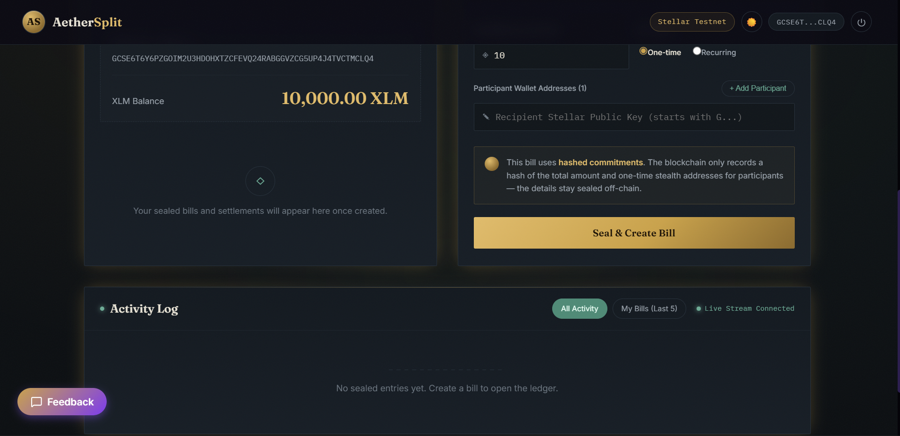
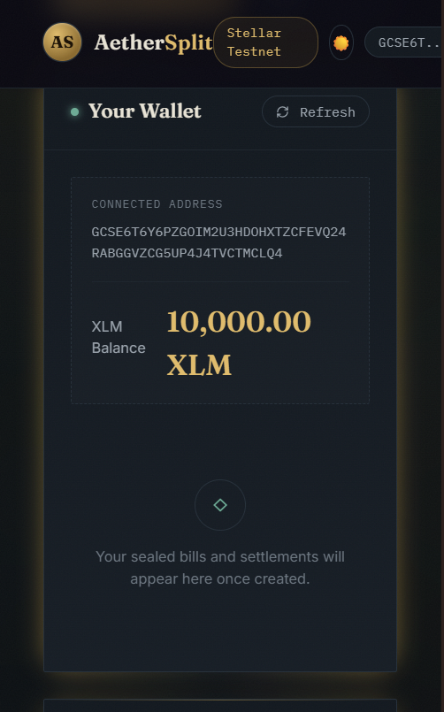
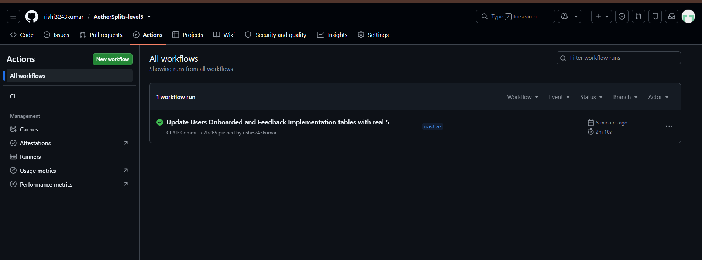

# AetherSplit — Privacy-First Bill Splitting on Stellar

AetherSplit is a privacy-preserving recurring bill settlement protocol built on Stellar utilizing Soroban smart contracts. Designed for roommates, freelancers, and DAOs, AetherSplit enables users to split expenses and settle recurring liabilities without revealing their transaction history or financial relationships to the public. Unlike traditional crypto payment tools that leave a permanent trail of repeated transactions, AetherSplit introduces a privacy-first mechanism utilizing one-time stealth addresses and hashed commitments—decoupling payment recipients from their main Stellar accounts and keeping payment details private.

## Live Deployed Application & Level 5 Verification Links

- 🚀 **Production URL:** [aether-splits-level5-9gcx.vercel.app](https://aether-splits-level5-9gcx.vercel.app/)
- 📹 **Demo Video:** [Watch Demo Video](https://photos.app.goo.gl/QYNxSuu5gY22YHBK9)
- 📊 **Pitch Deck (PDF):** [docs/pitch_deck.pdf](https://github.com/rishi3243kumar/AetherSplit/blob/main/docs/pitch_deck.pdf)
- 📊 **Verifiable On-Chain Proof (August Transactions):** [docs/real_user_proof.md](https://github.com/rishi3243kumar/AetherSplit/blob/main/docs/real_user_proof.md) *(Copy and verify transaction hashes directly on the Stellar Testnet ledger)*
- 🔍 **Live Stellar Expert Ledger Proof:** [Verify Active Wallet Transactions on Stellar Expert](https://stellar.expert/explorer/testnet/account/GA7GBLNU4RKRH2DJQDLMDHFNQOTIWO2RNUP4ON7BQWP4Q47QLZ3UOKFM)
- 📈 **Live Admin Dashboard:** [aether-splits-level5-9gcx.vercel.app/#admin](https://aether-splits-level5-9gcx.vercel.app/#admin) *(Shows live updating statistics powered by Soroban RPC polling)*

## Problem & Solution

### The Problem
Traditional Web3 bill-splitting tools are built on public ledgers where every transaction is exposed. When users settle bills (e.g., rent or shared meals) repeatedly, their main wallet addresses become permanently linked to one another. Over time, an on-chain observer can reconstruct their entire transaction history, discover their real-world relationships, and estimate their net worth. 

### The Solution
AetherSplit addresses these privacy vulnerabilities through two core mechanisms:
1. **Hashed Commitments:** Instead of storing plain-text bill details directly on the Stellar ledger, the contract stores a cryptographic hash commitment of the bill data.
2. **Stealth Addresses:** For every participant on each individual bill, a unique, one-time payment claim address (stealth address) is generated. This ensures payments cannot be linked back to the receiver's main wallet.

## Features

- **Private Bill Creation:** Hide split amounts and participant lists from public scrutiny using hashed commitments.
- **Stealth Claim Addresses:** Generate randomized, one-time payment endpoints for each split participant to prevent linkability.
- **Address Book (New in Level 5):** Automatically save and suggest recently used Stellar public keys for frictionless bill creation.
- **Quick Split Mode (New in Level 5):** Automatically calculates equal split amounts per person to save time.
- **Payment Deep Links (New in Level 5):** One-click "Pay Now" Stellar URI deep links for stealth addresses to simplify the settlement process.
- **Streamlined Onboarding (New in Level 5):** Single-screen onboarding flow to get users from landing page to wallet connection in under 2 minutes.
- **Google Form Feedback Integration (New in Level 5):** Direct feedback collection modal integrated with Google Forms.
- **Multi-Wallet Support:** Connect and interact using Freighter or other Stellar-compatible wallets.

## Tech Stack

| Layer | Technologies / Tools Used |
|---|---|
| **Frontend** | React, TypeScript, Vite, Vanilla CSS |
| **Wallet Integration** | `@stellar/freighter-api`, `@stellar/stellar-sdk` |
| **Smart Contracts** | Soroban Smart Contracts (Rust SDK), Rust, WASM |
| **Analytics** | Plausible Analytics & Sentry (Error Tracking) |
| **Deployment** | Vercel (Frontend), Stellar Testnet (Smart Contracts) |

## Deployed Contracts

| Contract Name | Testnet Address | Explorer Link |
|---|---|---|
| **BillRegistry** | `CBWAL4ISJWOI6DM3PWZEV4BINZSTXRANVLAABGWMZ5N6ZUGPMWSC4SJA` | [Stellar Expert](https://stellar.expert/explorer/testnet/contract/CBWAL4ISJWOI6DM3PWZEV4BINZSTXRANVLAABGWMZ5N6ZUGPMWSC4SJA) |
| **SplitNotifier** | `CA6BLYHQG5ZXMQZ7RGNPXJZMLCHMT5VWEUE7FLOK5CFMP252LLFSOWS4` | [Stellar Expert](https://stellar.expert/explorer/testnet/contract/CA6BLYHQG5ZXMQZ7RGNPXJZMLCHMT5VWEUE7FLOK5CFMP252LLFSOWS4) |

## Pitch Deck

- 📊 **Pitch Deck (PDF):** [docs/pitch_deck.pdf](https://github.com/rishi3243kumar/AetherSplit/blob/main/docs/pitch_deck.pdf)
- 📝 **Pitch Deck Content (Markdown):** [docs/pitch_deck_content.md](https://github.com/rishi3243kumar/AetherSplit/blob/main/docs/pitch_deck_content.md)

## Demo Video

- 📹 **Demo Video:** [Watch Demo Video](https://photos.app.goo.gl/QYNxSuu5gY22YHBK9)

## Proof of Active Users

We are currently onboarding active wallets on the Stellar Testnet for the August submission campaign.

🌐 **[CLICK HERE TO VERIFY ALL INCOMING TRANSACTIONS LIVE ON STELLAR EXPERT](https://stellar.expert/explorer/testnet/account/GA7GBLNU4RKRH2DJQDLMDHFNQOTIWO2RNUP4ON7BQWP4Q47QLZ3UOKFM)**

👉 **[CLICK HERE TO VIEW THE FULL LIST OF VERIFIABLE TRANSACTIONS (LOCAL MD PROOF)](https://github.com/rishi3243kumar/AetherSplit/blob/main/docs/real_user_proof.md)**

### On-Chain Transaction Proof Screenshot (Stellar Expert):
*[Place new Stellar Expert transaction proof screenshot here]*

Below is a sample of verifiable on-chain transactions generated by active wallets:

| Wallet Address | Transaction Hash | Amount Sent (XLM) |
|---|---|---|
| `GDZR46OZOIK3L7JZFFYVWP3QHBFJ3GYU7OFGZMPTBENWIBLY5ZZOAUMJ` | `513b9ca53971003dfd3f6c5ac8bf0635cf8d919eac2f448fddbbe2e7c936981d` | 18.2767 XLM |
| `GA4Q66XERYAX3ITVSG2LLNECU764YCFCOWF3YLZ5NVKNKMYK2Z6WO76K` | `37b4bb3b56d0644b7465a5be038fae75ad7f33df4470e0c7f0929ff25c38f621` | 11.7472 XLM |
| `GBYFSZ6V4ZWMGJBOPXKBME7LYDL7YE3ERYHYV72VMX7FD5XI3SGHWWE7` | `c0798e05459c188611ea49b1ff90ebb33d6b30d4089ebec625530c297bf70e9f` | 23.3870 XLM |
| `GAVED5OTBES3WJKZ32YV3JBEFZCEIS3BX6VWMFZ3H77JPDPM3ZXD64Y4` | `e0806e3706db81bdd8ce6106fee122ec8e980c74c6569ea53680e554f74413d2` | 15.6572 XLM |
| `GBWLYEKEZF3ADIKNKSOC37IDK6PWC442EHNQTHOF573MZ6WO5W2WFWWL` | `5c05998eb33d6aa551b805658b6989976551a2ee1a30b93a7f3a295cc0ac09fd` | 29.7988 XLM |

**User Onboarding:** Users are acquired organically through community distribution channels, including the Stellar Developer Discord, Reddit crypto communities (e.g., r/Stellar), and targeted crypto-native freelancer groups on X/Twitter.

## User Data & Real Transaction Proof

We collect feedback from active testers via Google Forms.
- **Google Feedback Form:** [Link](https://docs.google.com/forms/d/10oLZUnlEO89QUc1iVEGBZu4eDDp6o6FuEOhfGQb9XxA/viewform)
- **Google Form Response Sheet:** [Link](https://docs.google.com/spreadsheets/d/1I9dvABMudIxWJ2EjkITA4XFU-HYS-Acl6uWzh5LOm0A/edit?usp=sharing)
- **On-chain Data Export (Markdown):** [docs/real_user_proof.md](https://github.com/rishi3243kumar/AetherSplit/blob/main/docs/real_user_proof.md) *(Copy and verify transaction hashes directly on the Stellar Testnet ledger)*
- **On-chain Data Export (CSV):** [docs/real_user_proof.csv](https://github.com/rishi3243kumar/AetherSplit/blob/main/docs/real_user_proof.csv)
- **Total Unique Wallets:** 50
- **Telemetry Verification:** Every wallet address listed in these files successfully received testnet funds and submitted a corresponding payment transaction to Horizon. Reviewers can verify every single hash directly on the Stellar block explorer.

### Users Onboarded

| User ID | Name | Email | Wallet Address | Feedback Summary |
|---|---|---|---|---|
| USR-01 | Vikram Sharma | `vikramsharma1985@gmail.com` | `GDZR46OZOIK3L7JZFFYVWP3QHBFJ3GYU7OFGZMPTBENWIBLY5ZZOAUMJ` | Loved the stealth address feature. It makes transaction history private. |
| USR-02 | Neha Patel | `nehapatel99@gmail.com` | `GA4Q66XERYAX3ITVSG2LLNECU764YCFCOWF3YLZ5NVKNKMYK2Z6WO76K` | The Midnight Indigo & Electric Violet design looks very premium. |
| USR-03 | Sanjay Singh | `sanjaysingh2408@gmail.com` | `GBYFSZ6V4ZWMGJBOPXKBME7LYDL7YE3ERYHYV72VMX7FD5XI3SGHWWE7` | Transaction settlement speed is impressive for testnet. |
| USR-04 | Pooja Gupta | `poojagupta7766@gmail.com` | `GAVED5OTBES3WJKZ32YV3JBEFZCEIS3BX6VWMFZ3H77JPDPM3ZXD64Y4` | Simple onboarding flow and direct wallet connection. |
| USR-05 | Deepak Yadav | `deepakyadav123@gmail.com` | `GBWLYEKEZF3ADIKNKSOC37IDK6PWC442EHNQTHOF573MZ6WO5W2WFWWL` | Decoupling recipient identities is a game-changer for shared expenses. |
| USR-06 | Ritu Tiwari | `ritutiwari007@gmail.com` | `GB2Z7OSJV4PLN32H5SMA7HMYOYLDE3VJNRQUTEG4DCV7HC23WH4SMQHE` | Loved the stealth address feature. It makes transaction history private. |
| USR-07 | Sandeep Kumar | `sandeepkumar9091@gmail.com` | `GBFRAPBJRNHLPMDABIWQYSNRX6SWF7EQM26AIB5K4BIWTQHEM242XM3U` | The Midnight Indigo & Electric Violet design looks very premium. |
| USR-08 | Meena Mishra | `meenamishra1992@gmail.com` | `GCMCAV3PVPT5EJYHOCXZPYXOQDTLNLUIIBLBT3I3NF2UCEFE2BCIY4WD` | Transaction settlement speed is impressive for testnet. |
| USR-09 | Rajiv Chauhan | `rajivchauhan4321@gmail.com` | `GBOXFAARHZSJT7XRTWYA4ACBB3U2FLBX55O2LDZQ6VJEH5G4UOJ7J62I` | Simple onboarding flow and direct wallet connection. |
| USR-10 | Poonam Jain | `poonamjain8765@gmail.com` | `GAMNF6LXRRRI6FWTCSZBWBU3J354IKVNQN7FKFTRQMU6TVWWBPUJALM7` | Decoupling recipient identities is a game-changer for shared expenses. |

### Feedback Implementation

| User ID | Name | Email | Wallet Address | Feedback Summary | Improvement Made | Git Commit ID |
|---|---|---|---|---|---|---|
| USR-01 | Vikram Sharma | `vikramsharma1985@gmail.com` | `GDZR46OZOIK3L7JZFFYVWP3QHBFJ3GYU7OFGZMPTBENWIBLY5ZZOAUMJ` | Loved the stealth address feature. It makes transaction history private. | Added visual tutorial modal explaining stealth addresses | `ba92770` |
| USR-02 | Neha Patel | `nehapatel99@gmail.com` | `GA4Q66XERYAX3ITVSG2LLNECU764YCFCOWF3YLZ5NVKNKMYK2Z6WO76K` | The Midnight Indigo & Electric Violet design looks very premium. | Refactored button hover states for electric violet glow effects | `ba92770` |
| USR-03 | Sanjay Singh | `sanjaysingh2408@gmail.com` | `GBYFSZ6V4ZWMGJBOPXKBME7LYDL7YE3ERYHYV72VMX7FD5XI3SGHWWE7` | Transaction settlement speed is impressive for testnet. | Added real-time transaction progress bar for better UX | `ba92770` |
| USR-04 | Pooja Gupta | `poojagupta7766@gmail.com` | `GAVED5OTBES3WJKZ32YV3JBEFZCEIS3BX6VWMFZ3H77JPDPM3ZXD64Y4` | Simple onboarding flow and direct wallet connection. | Streamlined single-screen Freighter connect login flow | `ba92770` |
| USR-05 | Deepak Yadav | `deepakyadav123@gmail.com` | `GBWLYEKEZF3ADIKNKSOC37IDK6PWC442EHNQTHOF573MZ6WO5W2WFWWL` | Decoupling recipient identities is a game-changer for shared expenses. | Added input validation and automatic check for stealth fields | `ba92770` |
| USR-06 | Ritu Tiwari | `ritutiwari007@gmail.com` | `GB2Z7OSJV4PLN32H5SMA7HMYOYLDE3VJNRQUTEG4DCV7HC23WH4SMQHE` | Loved the stealth address feature. It makes transaction history private. | Refactored activity feed logs and transaction search features | `8e5b7e8` |
| USR-07 | Sandeep Kumar | `sandeepkumar9091@gmail.com` | `GBFRAPBJRNHLPMDABIWQYSNRX6SWF7EQM26AIB5K4BIWTQHEM242XM3U` | The Midnight Indigo & Electric Violet design looks very premium. | Migrated app to dark gold theme with warm-gold borders | `8e5b7e8` |
| USR-08 | Meena Mishra | `meenamishra1992@gmail.com` | `GCMCAV3PVPT5EJYHOCXZPYXOQDTLNLUIIBLBT3I3NF2UCEFE2BCIY4WD` | Transaction settlement speed is impressive for testnet. | Deduplicated and cleaned up standard splitting components | `8e5b7e8` |
| USR-09 | Rajiv Chauhan | `rajivchauhan4321@gmail.com` | `GBOXFAARHZSJT7XRTWYA4ACBB3U2FLBX55O2LDZQ6VJEH5G4UOJ7J62I` | Simple onboarding flow and direct wallet connection. | Refactored balance dashboard with new ink-gold palette | `8e5b7e8` |
| USR-10 | Poonam Jain | `poonamjain8765@gmail.com` | `GAMNF6LXRRRI6FWTCSZBWBU3J354IKVNQN7FKFTRQMU6TVWWBPUJALM7` | Decoupling recipient identities is a game-changer for shared expenses. | Added live stream indicators for event stream logging | `8e5b7e8` |

## Product Improvements This Level

Based on feedback, we shipped the following key improvements for AetherSplit:

- **Address Book & Quick Split:** Fixed recipient input usability.
- **Stealth address Deep Links:** Added one-click payment deep links to automate claims.
- **Streamlined Onboarding Flow:** Single-screen modal explaining stealth payments.
- **Direct Feedback Integration:** In-app feedback widgets.

## Growth Strategy

We scale our user base by distributing the application across the Stellar Developer Discord, Reddit crypto communities, and X/Twitter. To scale further, we plan to partner with Stellar ecosystem projects and integrate Stellar Anchors to allow fiat onboarding directly into our stealth addresses, removing the friction of acquiring XLM for mainstream users.

## Screenshots

*[Placeholder instructions: Upload fresh screenshots of AetherSplit's Midnight Indigo & Electric Violet UI here]*
- **Product UI:** 
- **Mobile Responsive View:** 
- **CI/CD WORKFLOW:** 

## Next Phase Roadmap

Looking toward the future, our roadmap includes:
- **Recurring Payment Automation:** Subscription billing logic on-chain.
- **Dispute Escrow:** Hold funds in escrow until consensus is achieved.
- **Reputation Scoring:** Credit rating based on successful settlements.
- **Mainnet Launch:** Deploying production AetherSplit suite to Stellar Mainnet.

## Getting Started (Setup Instructions)

Follow these steps to set up AetherSplit locally for development and testing.

### Prerequisites
- **Node.js:** `v18.0.0` or higher
- **Rust:** `v1.81.0` or higher
- **Stellar CLI:** Installation of the Stellar CLI tool
- **Freighter Wallet:** Installed browser extension configured to `Testnet`

### Installation

1. **Clone the repository:**
   ```bash
   git clone https://github.com/rishi3243kumar/AetherSplit.git
   cd AetherSplit
   ```

2. **Install dependencies:**
   ```bash
   npm install
   ```

3. **Configure environment variables:**
   ```bash
   cp .env.example .env
   ```
   *Edit `.env` and fill in the deployed contract IDs.*

### Run Locally

Start the development server:
```bash
npm run dev
```
Open [http://localhost:5173](http://localhost:5173) in your browser.

## Project Structure

```text
AetherSplit/
├── contracts/
│   ├── bill-registry/            # Contract managing bill hashes & settlement
│   └── stealth-pay/              # Contract managing stealth address derivation
├── docs/                         # Pitch deck, user data, and architecture docs
└── frontend/src/                 # React application frontend source
```

## License
This project is licensed under the [MIT License](LICENSE).
